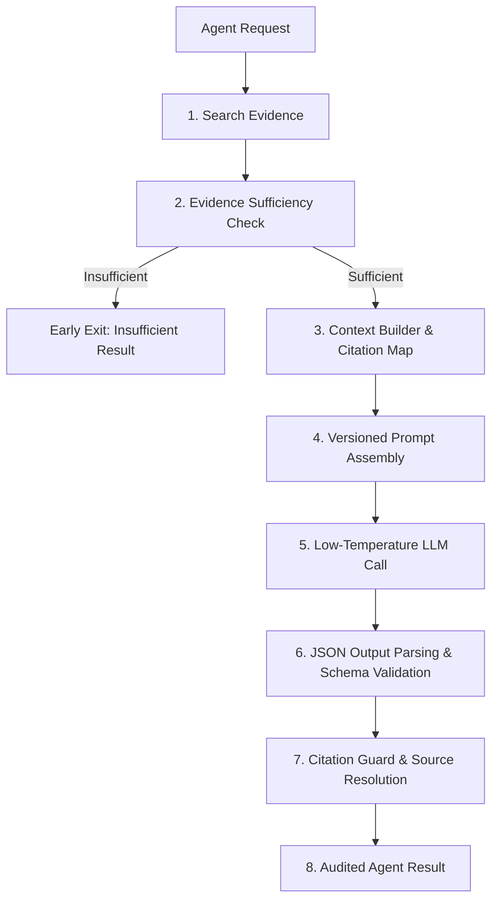

# BusinessMind AI — Backend Architecture Guide

## Core Architectural Layers

1. **Presentation Layer (`modules/<module>/*.controller.ts`, `routes/`, `validators/`)**
   - Handles HTTP requests/responses using standard response envelope utils.
   - Validates input using Zod schemas via `validate` middleware.
   - Converts promises safely using `asyncHandler`.

2. **Business Logic Layer (`modules/<module>/*.service.ts`)**
   - Contains core domain rules.
   - Throws domain errors extending `AppError`.
   - Decoupled from HTTP concerns (no `req`/`res` objects).

3. **Data Access Layer (`repositories/`, `modules/<module>/*.repository.ts`)**
   - Implements `IRepository<T>` interface.
   - Extends `BaseRepository` for generic Mongoose operations.
   - Maps database models to clean domain entities.

4. **Cross-Cutting Concerns (`middlewares/`, `utils/`, `config/`)**
   - JWT authentication (`authenticate`, `optionalAuthenticate`)
   - Role-Based Access Control (`authorize`)
   - Permission-Based Access Control (`requirePermission`, `requireAnyPermission`)
   - Rate limiting, security headers (Helmet), input sanitisation, HTTP request logging (Pino/Morgan), global error handling.

---

## Security Foundation

- **Helmet**: Disables sensitive headers, enforces CSP and HSTS.
- **CORS**: Environment-aware CORS configuration.
- **Rate Limiting**: Tiered limiters for global, auth, AI, and file upload endpoints.
- **JWT**: Dual-token pattern (short-lived access tokens + long-lived refresh tokens).
- **Password Hashing**: Bcrypt with configurable salt rounds and strength validation.
- **Zod**: Strict request body, query, and parameter validation.

---

## AI Agent Architecture (Phase 10)

BusinessMind AI implements a registry-based, multi-domain specialized agent system (`AgentRegistry`). Each agent implements the `IAgent` contract and handles a specific analytical domain:

1. **Sales Intelligence Agent** (`sales`): Analyzes revenue trends, pipeline progression, regional breakdowns, and period comparisons.
2. **Finance Intelligence Agent** (`finance`): Focuses on P&L, margins (gross, operating, net), cash flow, and cost categories. Restricts calculations to structured factual outputs with explicit inputs and arithmetic shown.
3. **Customer Intelligence Agent** (`customer`): Analyzes churn risks, segment growth, retention rates, and CSAT. Enforces data minimization to exclude individual PII and focus on segment-level aggregates.
4. **Inventory Intelligence Agent** (`inventory`): Tracks stock levels, stockout risks, overstocks, and inventory turnover. Requires numeric evidence of stock declines before labeling a stockout risk.
5. **Market Intelligence Agent** (`market`): Synthesizes industry reports and competitor analyses. Explicitly forbids using internal training knowledge — falls back to an insufficient-evidence response requesting report uploads if no documents are found.
6. **Risk Intelligence Agent** (`risk`): Performs cross-domain risk scanning. Evaluates risk severity (HIGH/MEDIUM/LOW) with domain tagging and evidence justification, preventing high-severity claims based on inference alone.

### Specialized Agent Execution Pipeline

All specialized agents execute a strict 8-step lifecycle within `AgentExecutionService` to ensure consistency, security, and factual grounding:

1. **Tenant-Isolated Retrieval**: Searches vector embeddings filtered strictly by the user's `organizationId`.
2. **Sufficiency Filtering**: Rejects queries early via `EvidenceSufficiencyChecker` if retrieved chunks are inadequate, avoiding LLM hallucinations.
3. **Context Assembly**: Limits tokens, creates source indices (S1, S2), and extracts temporal context (`hasTemporalContext`).
4. **Prompt Versioning**: Builds organization-specific, version-controlled prompts featuring prompt injection defense.
5. **Low-Temperature Execution**: Queries LLM provider with `temperature: 0.1` for maximum predictability.
6. **Schema Validation**: Ensures valid JSON schema parsing (findings, confidence, limitations, risks).
7. **Citation Hallucination Guard**: Cross-references LLM citation tags against original retrieved chunks, dropping fabricated citations.
8. **Citation Mapping**: Resolves valid citation tags (e.g., `S1`) to metadata (document name, page number, sheet name) and returns the final result.

### Safety & Compliance Guarantees

*   **Analysis-Only Constraint**: Agents perform analysis only. They cannot execute transactions, alter databases, contact customers, or place reorder requests.
*   **Prompt Injection Defense**: All retrieved documents are formatted inside isolated blocks and treated strictly as untrusted user data, preventing prompt injection attacks from taking control of agent behavior.

